# 🤖 PM Jira Agent - Enhanced Multi-Agent Workflow

**Enhanced Multi-Agent System with Standardized JSON Handovers and API Integration**

[]()
[]()
[]()
[]()

## 📋 **Overview**

This document defines an enhanced multi-agent workflow for the PM Jira Agent system where **all agent handovers use standardized Jira ticket JSON format** and each agent can access **GitBook API and Jira API** for comprehensive research and context gathering.

### 🎯 **Key Enhancements**

- **Standardized JSON Format**: All agents exchange Jira ticket JSON with metadata
- **API Integration**: Every agent can search GitBook documentation and Jira tickets
- **Visual Enhancement**: Rich formatting with emojis, bold, italic, and code blocks
- **Research-Driven**: Context gathering from existing documentation and tickets
- **Quality Bonuses**: Additional scoring for effective API usage

---

## 📋 **Standardized Jira Ticket JSON Format**

All agents use this standardized format for handovers, based on Jira REST API v3 specifications:

```json
{
  "jira_ticket": {
    "fields": {
      "project": {
        "key": "AHSSI"
      },
      "summary": "Implement OAuth2 authentication with multi-factor support",
      "description": {
        "type": "doc",
        "version": 1,
        "content": [
          {
            "type": "heading",
            "attrs": { "level": 2 },
            "content": [{ "type": "text", "text": "📋 Overview" }]
          },
          {
            "type": "paragraph",
            "content": [
              { "type": "text", "text": "This ticket addresses the implementation of " },
              { "type": "text", "text": "OAuth2 authentication", "marks": [{ "type": "strong" }] },
              { "type": "text", "text": " with multi-factor authentication support." }
            ]
          },
          {
            "type": "heading",
            "attrs": { "level": 3 },
            "content": [{ "type": "text", "text": "✅ Acceptance Criteria" }]
          },
          {
            "type": "bulletList",
            "content": [
              {
                "type": "listItem",
                "content": [
                  {
                    "type": "paragraph",
                    "content": [
                      { "type": "text", "text": "User can authenticate using " },
                      { "type": "text", "text": "OAuth2 PKCE flow", "marks": [{ "type": "code" }] }
                    ]
                  }
                ]
              }
            ]
          }
        ]
      },
      "issuetype": {
        "name": "Story"
      },
      "priority": {
        "name": "High"
      },
      "assignee": {
        "accountId": "auto-assign"
      },
      "labels": ["oauth2", "security", "authentication", "mfa"],
      "components": [
        { "name": "Authentication" },
        { "name": "Security" }
      ],
      "customfield_10016": 8,  // Story Points
      "customfield_10020": {   // Sprint
        "id": "current_sprint"
      }
    }
  },
  "agent_metadata": {
    "source_agent": "pm_agent",
    "target_agent": "tech_lead_agent",
    "processing_timestamp": "2025-07-06T10:30:00Z",
    "quality_score": 0.85,
    "iterations": 1,
    "validation_status": "approved",
    "research_sources": [
      {
        "type": "gitbook",
        "title": "Authentication Implementation Guide",
        "url": "https://gitbook.com/space/auth-guide",
        "relevance_score": 0.92
      },
      {
        "type": "jira_ticket",
        "key": "AHSSI-1234",
        "title": "Previous OAuth implementation",
        "relevance_score": 0.88
      }
    ],
    "api_calls": {
      "gitbook_searches": 3,
      "jira_searches": 2,
      "total_duration": "2.3s"
    }
  },
  "quality_dimensions": {
    "summary_clarity": 0.90,
    "user_story_format": 0.85,
    "acceptance_criteria": 0.80,
    "business_value": 0.88,
    "technical_feasibility": 0.82
  }
}
```

---

## 🔄 **Enhanced Multi-Agent Workflow**

### **Workflow Overview**


### **Quality Gate Flow**

```mermaid
graph TD
    A[User Request] --> B[PM Agent]
    B --> C{Quality Gate 1}
    C -->|Pass ≥0.7| D[Tech Lead Agent]
    C -->|Fail <0.7| E[PM Refinement]
    E --> B
    
    D --> F{Quality Gate 2}
    F -->|Pass ≥0.8| G[QA Agent]
    F -->|Refine 0.6-0.8| H[Tech-PM Collaboration]
    F -->|Fail <0.6| I[Reject & Restart]
    H --> D
    
    G --> J{Quality Gate 3}
    J -->|Pass ≥0.75| K[Business Rules Agent]
    J -->|Refine 0.6-0.75| L[QA-Tech Collaboration]
    J -->|Fail <0.6| M[Back to Tech Lead]
    L --> G
    
    K --> N{Quality Gate 4}
    N -->|Pass ≥0.85| O[Jira Creator Agent]
    N -->|Fail <0.85| P[Compliance Escalation]
    
    O --> Q{Creation Validation}
    Q -->|Success| R[Final Ticket]
    Q -->|Fail| S[Error Recovery]
    S --> O
```



---

## 🤖 **Agent Responsibilities & API Integration**

### **Phase 1: PM Agent - Research & Initial Draft**

**🎯 Primary Responsibilities:**
- Research GitBook documentation for context
- Search Jira for similar/related tickets
- Analyze user request and extract requirements
- Create initial Jira ticket JSON with business context
- Provide reasoning and business value assessment

**🔍 API Integration:**
```python
async def pm_agent_process(user_request: str) -> dict:
    # 1. GitBook API Research
    gitbook_results = await gitbook_api.search_documentation({
        "query": extract_keywords(user_request),
        "space_id": "Jw57BieQciFYoCHgwVlm",
        "limit": 10
    })
    
    # 2. Jira API Context Search
    jira_results = await jira_api.search_issues({
        "jql": f"text ~ '{extract_keywords(user_request)}' ORDER BY updated DESC",
        "fields": ["summary", "description", "labels", "components"],
        "maxResults": 5
    })
    
    # 3. Context Analysis & Reasoning
    context_analysis = analyze_research_data(gitbook_results, jira_results)
    
    # 4. Create Initial Jira Ticket JSON
    jira_ticket = create_initial_ticket_json(
        user_request=user_request,
        context=context_analysis,
        research_sources=gitbook_results + jira_results
    )
    
    # 5. Quality Assessment
    quality_score = assess_pm_quality(jira_ticket)
    
    return {
        "jira_ticket": jira_ticket,
        "agent_metadata": {
            "source_agent": "pm_agent",
            "target_agent": "tech_lead_agent",
            "quality_score": quality_score,
            "research_sources": gitbook_results + jira_results,
            "reasoning": context_analysis["reasoning"]
        }
    }
```

**📊 Quality Dimensions (Target: ≥0.7):**
- **Summary Clarity** (0-1.0): Clear, action-oriented summary
- **User Story Format** (0-1.0): Proper "As a... I want... So that..." structure
- **Initial Acceptance Criteria** (0-1.0): Basic criteria outlined
- **Business Value** (0-1.0): Value proposition articulated
- **Context Research** (0-1.0): Relevant documentation and tickets found

**🤝 Handover to Tech Lead:**
```json
{
  "handover_type": "pm_to_tech_lead",
  "jira_ticket": { /* Complete Jira JSON with business context */ },
  "agent_metadata": {
    "source_agent": "pm_agent",
    "target_agent": "tech_lead_agent",
    "quality_score": 0.82,
    "research_summary": "Found 3 relevant GitBook pages and 2 similar Jira tickets",
    "reasoning": "User request aligns with existing OAuth patterns but requires MFA enhancement"
  }
}
```

---

### **Phase 2: Tech Lead Agent - Technical Enhancement**

**🎯 Primary Responsibilities:**
- Enhance ticket with technical requirements and architecture
- Research technical documentation and implementation patterns
- Assess technical feasibility and complexity
- Provide detailed technical feedback and implementation guidance
- Collaborate with PM Agent for refinements if needed

**🔍 API Integration:**
```python
async def tech_lead_agent_process(pm_handover: dict) -> dict:
    jira_ticket = pm_handover["jira_ticket"]
    
    # 1. Additional Technical Research
    technical_research = await research_technical_context({
        "gitbook_api": "search for architecture patterns, API documentation",
        "jira_api": "find technical implementation tickets, bugs, technical debt",
        "confluence_api": "search technical documentation and RFCs"
    })
    
    # 2. Technical Enhancement of JSON
    enhanced_ticket = enhance_technical_aspects(jira_ticket, {
        "technical_requirements": extract_technical_requirements(jira_ticket),
        "architecture_patterns": technical_research["patterns"],
        "implementation_complexity": assess_complexity(jira_ticket),
        "dependencies": identify_dependencies(jira_ticket),
        "risk_assessment": analyze_technical_risks(jira_ticket)
    })
    
    # 3. Update Description with Technical Details
    enhanced_ticket["fields"]["description"] = add_technical_sections(
        enhanced_ticket["fields"]["description"],
        {
            "technical_approach": "OAuth2 with PKCE flow + TOTP MFA",
            "architecture_impact": "Requires new authentication service and user session management",
            "dependencies": ["User service", "Token service", "MFA service"],
            "implementation_notes": "Use existing OAuth2 library, implement TOTP generator",
            "performance_considerations": "Token caching, session management optimization"
        }
    )
    
    # 4. Technical Quality Assessment
    quality_score = assess_tech_lead_quality(enhanced_ticket)
    
    return {
        "jira_ticket": enhanced_ticket,
        "agent_metadata": {
            "source_agent": "tech_lead_agent",
            "target_agent": "qa_agent",
            "quality_score": quality_score,
            "technical_enhancements": technical_research,
            "complexity_assessment": "Medium-High",
            "collaboration_needed": quality_score < 0.8
        }
    }
```

**📊 Quality Dimensions (Target: ≥0.8):**
- **Technical Accuracy** (0-1.0): Correct technical approach and architecture
- **Complexity Assessment** (0-1.0): Realistic complexity evaluation
- **Architecture Alignment** (0-1.0): Fits existing system architecture
- **Risk Identification** (0-1.0): Technical risks identified and mitigated
- **Implementation Guidance** (0-1.0): Clear implementation steps and approach
- **Review Completeness** (0-1.0): Thorough technical review conducted
- **Feedback Quality** (0-1.0): Actionable feedback provided

**🔄 Collaboration Pattern:**
- **Score ≥0.8**: Direct handover to QA Agent
- **Score 0.6-0.8**: Collaborate with PM Agent for refinement (max 2 iterations)
- **Score <0.6**: Reject and restart with PM Agent

---

### **Phase 3: QA Agent - Testability Enhancement**

**🎯 Primary Responsibilities:**
- Enhance ticket with comprehensive testing strategy
- Research testing documentation and similar test implementations
- Define test coverage, automation strategy, and quality metrics
- Identify edge cases and quality assurance requirements
- Collaborate with Tech Lead for testability improvements

**🔍 API Integration:**
```python
async def qa_agent_process(tech_lead_handover: dict) -> dict:
    jira_ticket = tech_lead_handover["jira_ticket"]
    
    # 1. Testability Research
    test_research = await research_testing_context({
        "gitbook_api": "search testing documentation, patterns, and guidelines",
        "jira_api": "find similar testing implementations, test cases, bugs",
        "test_case_repository": "search existing test cases and automation scripts"
    })
    
    # 2. Enhance Ticket with Test Requirements
    enhanced_ticket = add_testing_sections(jira_ticket, {
        "test_scenarios": generate_test_scenarios(jira_ticket),
        "automation_strategy": design_automation_approach(jira_ticket),
        "performance_criteria": define_performance_tests(jira_ticket),
        "security_testing": outline_security_tests(jira_ticket),
        "edge_cases": identify_edge_cases(jira_ticket),
        "quality_metrics": define_quality_metrics(jira_ticket)
    })
    
    # 3. Update Description with Testing Details
    enhanced_ticket["fields"]["description"] = add_testing_sections(
        enhanced_ticket["fields"]["description"],
        {
            "test_coverage": "Unit: 90%, Integration: 85%, E2E: 75%",
            "automation_tools": ["Jest", "Cypress", "Postman", "JMeter"],
            "test_data": "Mock users, OAuth providers, MFA scenarios",
            "performance_benchmarks": "Auth flow <500ms, MFA verification <200ms",
            "security_tests": "OWASP Top 10, OAuth2 security best practices"
        }
    )
    
    # 4. QA Quality Assessment
    quality_score = assess_qa_quality(enhanced_ticket)
    
    return {
        "jira_ticket": enhanced_ticket,
        "agent_metadata": {
            "source_agent": "qa_agent",
            "target_agent": "business_rules_agent",
            "quality_score": quality_score,
            "testability_assessment": test_research,
            "automation_feasibility": "High",
            "edge_cases_identified": len(enhanced_ticket.get("edge_cases", []))
        }
    }
```

**📊 Quality Dimensions (Target: ≥0.75):**
- **Testability Assessment** (0-1.0): Clear testability evaluation
- **Test Coverage Planning** (0-1.0): Comprehensive test coverage strategy
- **Automation Feasibility** (0-1.0): Realistic automation approach
- **Edge Case Identification** (0-1.0): Edge cases identified and planned
- **Quality Metrics** (0-1.0): Clear quality criteria and benchmarks
- **Testing Strategy** (0-1.0): Complete testing approach and methodology

**🔄 Collaboration Pattern:**
- **Score ≥0.75**: Direct handover to Business Rules Agent
- **Score 0.6-0.75**: Collaborate with Tech Lead for testability improvements (max 1 iteration)
- **Score <0.6**: Back to Tech Lead for technical refinement

---

### **Phase 4: Business Rules Agent - Compliance Enhancement**

**🎯 Primary Responsibilities:**
- Enhance ticket with compliance and regulatory requirements
- Research company policies, regulatory frameworks, and industry standards
- Define approval workflows and governance requirements
- Assess business risks and compliance implications
- Escalate to stakeholders if compliance thresholds not met

**🔍 API Integration:**
```python
async def business_rules_agent_process(qa_handover: dict) -> dict:
    jira_ticket = qa_handover["jira_ticket"]
    
    # 1. Compliance Research
    compliance_research = await research_compliance_context({
        "gitbook_api": "search compliance, regulatory, and policy documentation",
        "jira_api": "find compliance-related tickets, audit issues, policy implementations",
        "policy_database": "check company policies and procedures",
        "regulatory_api": "check GDPR, SOX, HIPAA, PCI-DSS requirements"
    })
    
    # 2. Enhance with Compliance Requirements
    enhanced_ticket = add_compliance_sections(jira_ticket, {
        "regulatory_requirements": extract_regulatory_needs(jira_ticket),
        "data_protection": assess_data_protection_needs(jira_ticket),
        "approval_workflow": determine_approval_chain(jira_ticket),
        "audit_requirements": define_audit_trail_needs(jira_ticket),
        "risk_assessment": conduct_business_risk_assessment(jira_ticket),
        "policy_alignment": check_policy_compliance(jira_ticket)
    })
    
    # 3. Update Description with Compliance Details
    enhanced_ticket["fields"]["description"] = add_compliance_sections(
        enhanced_ticket["fields"]["description"],
        {
            "gdpr_compliance": "Personal data encryption, consent management, right to deletion",
            "security_standards": "OAuth2 RFC 6749, FIDO2 for MFA, OWASP guidelines",
            "audit_trail": "All authentication events logged with user correlation",
            "data_retention": "Authentication logs retained for 90 days",
            "approval_required": "Security team approval required for production deployment"
        }
    )
    
    # 4. Compliance Quality Assessment
    quality_score = assess_compliance_quality(enhanced_ticket)
    
    return {
        "jira_ticket": enhanced_ticket,
        "agent_metadata": {
            "source_agent": "business_rules_agent",
            "target_agent": "jira_creator_agent",
            "quality_score": quality_score,
            "compliance_assessment": compliance_research,
            "approval_required": quality_score < 0.90,
            "stakeholder_notification": quality_score < 0.85
        }
    }
```

**📊 Quality Dimensions (Target: ≥0.85):**
- **Regulatory Compliance** (0-1.0): Meets all applicable regulatory requirements
- **Business Policy Alignment** (0-1.0): Aligns with company policies and procedures
- **Approval Workflow** (0-1.0): Correct approval chain and governance
- **Risk Assessment** (0-1.0): Comprehensive business and compliance risk evaluation
- **Documentation Requirements** (0-1.0): Complete documentation and audit trail needs

**🔄 Escalation Pattern:**
- **Score ≥0.85**: Direct handover to Jira Creator Agent
- **Score <0.85**: Automatic stakeholder notification and compliance review
- **Score <0.70**: Escalation to approval authority with detailed compliance gap report

---

### **Phase 5: Jira Creator Agent - Final Enhancement & Creation**

**🎯 Primary Responsibilities:**
- Apply final visual formatting with emojis, bold, italic, and code blocks
- Enhance description readability and visual hierarchy
- Create ticket via Jira API with comprehensive error handling
- Validate ticket creation and apply workflow metadata
- Generate audit trail and completion confirmation

**🔍 API Integration & Visual Enhancement:**
```python
async def jira_creator_agent_process(business_rules_handover: dict) -> dict:
    jira_ticket = business_rules_handover["jira_ticket"]
    
    # 1. Final Format Enhancement with Rich Text
    enhanced_description = enhance_visual_formatting(
        jira_ticket["fields"]["description"],
        {
            "add_emojis": True,
            "enhance_headers": True,
            "format_code_blocks": True,
            "add_visual_hierarchy": True,
            "improve_readability": True
        }
    )
    
    # 2. Final Ticket Structure Optimization
    final_ticket = {
        "fields": {
            **jira_ticket["fields"],
            "description": enhanced_description,
            "labels": optimize_labels(jira_ticket["fields"]["labels"]),
            "components": validate_components(jira_ticket["fields"]["components"]),
            "priority": validate_priority(jira_ticket["fields"]["priority"]),
            "customfield_10016": calculate_story_points(jira_ticket)  # Story Points
        }
    }
    
    # 3. Create Ticket via Jira API
    creation_result = await jira_api.create_issue(final_ticket)
    
    # 4. Post-Creation Validation and Enhancement
    if creation_result["success"]:
        ticket_key = creation_result["key"]
        
        # Validate creation
        validation_result = await validate_created_ticket(ticket_key)
        
        # Add workflow metadata as comment
        workflow_comment = generate_workflow_metadata_comment(business_rules_handover)
        await jira_api.add_comment(ticket_key, {"body": workflow_comment})
        
        # Add quality metrics as comment
        quality_comment = generate_quality_metrics_comment(business_rules_handover)
        await jira_api.add_comment(ticket_key, {"body": quality_comment})
        
        # Update ticket with final metadata
        await jira_api.update_issue(ticket_key, {
            "fields": {
                "labels": final_ticket["fields"]["labels"] + ["ai-generated", "multi-agent-validated"]
            }
        })
    
    return {
        "jira_ticket": final_ticket,
        "creation_result": creation_result,
        "agent_metadata": {
            "source_agent": "jira_creator_agent",
            "ticket_key": creation_result.get("key"),
            "creation_status": "success" if creation_result["success"] else "failed",
            "validation_passed": validation_result.get("valid", False),
            "visual_enhancements_applied": True
        }
    }

def enhance_visual_formatting(description_json: dict) -> dict:
    """
    Enhanced visual formatting using Jira's Atlassian Document Format (ADF)
    """
    enhanced_content = []
    
    # Emoji mapping for headers
    emoji_map = {
        "Overview": "📋",
        "Technical Requirements": "⚙️", 
        "Technical Approach": "🏗️",
        "Testing Strategy": "🧪",
        "Test Coverage": "📊",
        "Compliance": "🛡️",
        "Security": "🔒",
        "Acceptance Criteria": "✅",
        "Performance": "⚡",
        "Dependencies": "🔗",
        "Implementation": "🚀",
        "Documentation": "📚"
    }
    
    for section in description_json["content"]:
        if section["type"] == "heading":
            # Add emojis to headers
            text_content = section["content"][0]["text"]
            emoji = emoji_map.get(text_content, "🔹")
            section["content"][0]["text"] = f"{emoji} {text_content}"
            
        elif section["type"] == "paragraph":
            # Enhance text with formatting
            for content_item in section.get("content", []):
                if content_item["type"] == "text":
                    text = content_item["text"]
                    
                    # Add code formatting for technical terms
                    technical_terms = ["OAuth2", "PKCE", "JWT", "TOTP", "API", "REST", "JSON", "HTTP", "HTTPS"]
                    for term in technical_terms:
                        if term in text and "marks" not in content_item:
                            content_item["marks"] = [{"type": "code"}]
                    
                    # Add emphasis for important items
                    important_words = ["must", "required", "critical", "mandatory", "essential"]
                    if any(word in text.lower() for word in important_words):
                        if "marks" not in content_item:
                            content_item["marks"] = []
                        content_item["marks"].append({"type": "strong"})
        
        enhanced_content.append(section)
    
    # Add visual separators between major sections
    enhanced_content = add_visual_separators(enhanced_content)
    
    return {
        "type": "doc",
        "version": 1,
        "content": enhanced_content
    }

def add_visual_separators(content: list) -> list:
    """Add visual separators and improved structure"""
    enhanced = []
    
    for i, section in enumerate(content):
        enhanced.append(section)
        
        # Add horizontal rule after major sections (h2 headings)
        if (section["type"] == "heading" and 
            section.get("attrs", {}).get("level") == 2 and 
            i < len(content) - 1):
            enhanced.append({
                "type": "rule"  # Horizontal line separator
            })
    
    return enhanced
```

**🎨 Visual Enhancement Examples:**

**Before:**
```
Technical Requirements
- OAuth2 implementation
- Multi-factor authentication
```

**After:**
```
⚙️ Technical Requirements

---

• **OAuth2** implementation with `PKCE` flow
• **Multi-factor authentication** using `TOTP` tokens
• `REST API` integration with existing user service
```

---

## 📊 **Enhanced Quality Scoring System**

### **Composite Quality Score Calculation**

```python
def calculate_enhanced_composite_score(workflow_data: dict) -> dict:
    """Calculate composite score including API integration quality"""
    
    agent_scores = {
        'pm_agent': workflow_data['pm_agent']['quality_score'],
        'tech_lead': workflow_data['tech_lead']['quality_score'],
        'qa_agent': workflow_data['qa_agent']['quality_score'],
        'business_rules': workflow_data['business_rules']['quality_score']
    }
    
    # Base weights for different aspects
    base_weights = {
        'pm_agent': 0.20,      # Business context and requirements
        'tech_lead': 0.35,     # Technical implementation and architecture
        'qa_agent': 0.25,      # Quality assurance and testing
        'business_rules': 0.20 # Compliance and governance
    }
    
    # Calculate base composite score
    base_score = sum(
        agent_scores[agent] * base_weights[agent] 
        for agent in base_weights
    )
    
    # API integration bonus (up to 0.1 additional points)
    api_integration_bonus = calculate_api_integration_score(workflow_data)
    
    # Research quality bonus (up to 0.05 additional points)
    research_quality_bonus = calculate_research_quality_score(workflow_data)
    
    final_score = min(base_score + api_integration_bonus + research_quality_bonus, 1.0)
    
    return {
        "composite_score": final_score,
        "agent_scores": agent_scores,
        "base_score": base_score,
        "api_integration_bonus": api_integration_bonus,
        "research_quality_bonus": research_quality_bonus,
        "quality_level": determine_quality_level(final_score)
    }

def calculate_api_integration_score(workflow_data: dict) -> float:
    """Calculate bonus for effective API integration"""
    api_calls = []
    for agent_data in workflow_data.values():
        if "api_calls" in agent_data.get("agent_metadata", {}):
            api_calls.append(agent_data["agent_metadata"]["api_calls"])
    
    # Bonus factors
    gitbook_research_quality = min(sum(call.get("gitbook_searches", 0) for call in api_calls) * 0.01, 0.04)
    jira_context_quality = min(sum(call.get("jira_searches", 0) for call in api_calls) * 0.015, 0.03)
    
    # Research relevance bonus
    total_relevance = 0
    source_count = 0
    for agent_data in workflow_data.values():
        for source in agent_data.get("agent_metadata", {}).get("research_sources", []):
            total_relevance += source.get("relevance_score", 0)
            source_count += 1
    
    research_relevance = (total_relevance / max(source_count, 1)) * 0.03 if source_count > 0 else 0
    
    return min(gitbook_research_quality + jira_context_quality + research_relevance, 0.1)

def calculate_research_quality_score(workflow_data: dict) -> float:
    """Calculate bonus for research quality and context gathering"""
    research_factors = []
    
    for agent_data in workflow_data.values():
        metadata = agent_data.get("agent_metadata", {})
        
        # Number of quality research sources
        sources = metadata.get("research_sources", [])
        high_relevance_sources = [s for s in sources if s.get("relevance_score", 0) > 0.8]
        research_factors.append(len(high_relevance_sources) * 0.005)
        
        # API response time efficiency
        api_calls = metadata.get("api_calls", {})
        total_duration = api_calls.get("total_duration", "0s")
        if isinstance(total_duration, str) and total_duration.endswith("s"):
            duration = float(total_duration[:-1])
            if duration < 2.0:  # Fast API responses
                research_factors.append(0.005)
    
    return min(sum(research_factors), 0.05)

def determine_quality_level(score: float) -> str:
    """Determine quality level based on composite score"""
    if score >= 0.90:
        return "Excellent"
    elif score >= 0.80:
        return "Good"
    elif score >= 0.70:
        return "Acceptable"
    elif score >= 0.60:
        return "Needs Improvement"
    else:
        return "Poor"
```

### **Quality Gate Thresholds**

| Agent | Minimum Score | Target Score | Excellent Score | API Bonus Potential |
|-------|---------------|--------------|-----------------|-------------------|
| **PM Agent** | 0.60 | 0.70 | 0.85 | +0.02 |
| **Tech Lead Agent** | 0.60 | 0.80 | 0.90 | +0.03 |
| **QA Agent** | 0.60 | 0.75 | 0.85 | +0.02 |
| **Business Rules Agent** | 0.70 | 0.85 | 0.95 | +0.03 |
| **Composite Score** | **0.65** | **0.78** | **0.88** | **+0.10** |

### **Performance Metrics & Targets**

#### **API Integration Metrics**
| Metric | Target | Excellent |
|--------|--------|-----------|
| **GitBook Research Calls** | 2-3 per agent | 4+ relevant calls |
| **Jira Context Searches** | 1-2 per agent | 3+ contextual searches |
| **Research Relevance Score** | >0.8 average | >0.9 average |
| **API Response Time** | <500ms per call | <300ms per call |
| **Total Research Duration** | <3s per agent | <2s per agent |

#### **Workflow Performance Metrics**
| Metric | Target | Excellent |
|--------|--------|-----------|
| **Total Workflow Duration** | <20s | <15s |
| **First-Pass Success Rate** | >70% | >85% |
| **Refinement Success Rate** | >90% | >95% |
| **Compliance Pass Rate** | >95% | >98% |
| **API Integration Success** | >98% | >99.5% |

---

## 🔄 **Interaction Patterns & Handover Protocols**

### **1. Sequential Progression Pattern**
```
PM Agent → Tech Lead Agent → QA Agent → Business Rules Agent → Jira Creator Agent
```
**When:** All quality gates pass on first attempt  
**Duration:** 12-18 seconds  
**Success Rate:** ~65-70%  
**API Calls:** 8-12 total across all agents  

### **2. Collaborative Refinement Pattern**
```
PM Agent ⟷ Tech Lead Agent (2 iterations) → QA Agent → Business Rules Agent → Jira Creator Agent
```
**When:** Tech Lead identifies improvement opportunities  
**Duration:** 20-30 seconds  
**Success Rate:** ~85-90%  
**API Calls:** 12-16 total with additional research  

### **3. Quality Enhancement Pattern**
```
PM Agent → Tech Lead Agent ⟷ QA Agent (1 iteration) → Business Rules Agent → Jira Creator Agent
```
**When:** QA identifies testability or quality issues  
**Duration:** 25-35 seconds  
**Success Rate:** ~80-85%  
**API Calls:** 10-14 total with focused QA research  

### **4. Compliance Escalation Pattern**
```
PM Agent → Tech Lead Agent → QA Agent → Business Rules Agent → [Stakeholder Approval] → Jira Creator Agent
```
**When:** Compliance issues require stakeholder approval  
**Duration:** Variable (5-60 minutes depending on approval)  
**Success Rate:** ~95% (after approval)  
**API Calls:** 8-12 total plus compliance documentation research  

### **5. Error Recovery Pattern**
```
Any Agent → Error Detection → Recovery Research → Retry/Escalate → Continue Workflow
```
**When:** API failures, validation errors, or quality threshold failures  
**Duration:** +10-20 seconds recovery time  
**Success Rate:** ~90% recovery success  
**API Calls:** Additional retry calls with exponential backoff  

---

## 🏗️ **Implementation Architecture**

### **Agent Communication Framework**

```python
class AgentWorkflowOrchestrator:
    """Enhanced orchestrator with JSON handovers and API integration"""
    
    def __init__(self):
        self.agents = {
            "pm_agent": PMAgent(api_clients=self.api_clients),
            "tech_lead_agent": TechLeadAgent(api_clients=self.api_clients),
            "qa_agent": QAAgent(api_clients=self.api_clients),
            "business_rules_agent": BusinessRulesAgent(api_clients=self.api_clients),
            "jira_creator_agent": JiraCreatorAgent(api_clients=self.api_clients)
        }
        
        self.api_clients = {
            "gitbook": GitBookAPIClient(),
            "jira": JiraAPIClient(),
            "confluence": ConfluenceAPIClient()  # Optional additional research
        }
        
        self.quality_gates = QualityGateSystem()
        self.workflow_tracker = WorkflowTracker()
    
    async def process_workflow(self, user_request: str) -> dict:
        """Process complete workflow with JSON handovers"""
        
        workflow_id = generate_workflow_id()
        workflow_data = {}
        
        try:
            # Phase 1: PM Agent
            pm_result = await self.agents["pm_agent"].process(user_request)
            workflow_data["pm_agent"] = pm_result
            
            if not self.quality_gates.check_pm_gate(pm_result):
                return await self.handle_quality_failure("pm_agent", pm_result)
            
            # Phase 2: Tech Lead Agent (with potential collaboration)
            tech_result = await self.process_tech_lead_phase(pm_result, workflow_data)
            workflow_data["tech_lead_agent"] = tech_result
            
            # Phase 3: QA Agent (with potential collaboration)
            qa_result = await self.process_qa_phase(tech_result, workflow_data)
            workflow_data["qa_agent"] = qa_result
            
            # Phase 4: Business Rules Agent
            business_result = await self.agents["business_rules_agent"].process(qa_result)
            workflow_data["business_rules_agent"] = business_result
            
            if business_result["agent_metadata"]["approval_required"]:
                approval_result = await self.handle_compliance_escalation(business_result)
                if not approval_result["approved"]:
                    return approval_result
            
            # Phase 5: Jira Creator Agent
            final_result = await self.agents["jira_creator_agent"].process(business_result)
            workflow_data["jira_creator_agent"] = final_result
            
            # Calculate final metrics
            final_metrics = self.calculate_final_metrics(workflow_data)
            
            return {
                "status": "success",
                "workflow_id": workflow_id,
                "ticket_key": final_result["agent_metadata"]["ticket_key"],
                "final_metrics": final_metrics,
                "workflow_data": workflow_data
            }
            
        except Exception as e:
            return await self.handle_workflow_error(workflow_id, e, workflow_data)
    
    async def process_tech_lead_phase(self, pm_result: dict, workflow_data: dict) -> dict:
        """Handle Tech Lead phase with potential PM collaboration"""
        
        tech_result = await self.agents["tech_lead_agent"].process(pm_result)
        
        # Check if collaboration needed
        if (tech_result["agent_metadata"]["quality_score"] >= 0.6 and 
            tech_result["agent_metadata"]["quality_score"] < 0.8):
            
            # Collaboration loop (max 2 iterations)
            for iteration in range(2):
                collaboration_result = await self.agents["pm_agent"].collaborate_with_tech_lead(
                    tech_result["agent_metadata"]["feedback"]
                )
                
                # Re-process with Tech Lead
                tech_result = await self.agents["tech_lead_agent"].process(collaboration_result)
                
                if tech_result["agent_metadata"]["quality_score"] >= 0.8:
                    break
        
        return tech_result
```

### **API Client Integration**

```python
class EnhancedAPIClientManager:
    """Manages API clients with caching and error handling"""
    
    def __init__(self):
        self.gitbook_client = GitBookAPIClient()
        self.jira_client = JiraAPIClient()
        self.cache = APIResponseCache(ttl=300)  # 5-minute cache
        
    async def search_gitbook_context(self, query: str, agent_context: str) -> list:
        """Search GitBook with agent-specific context"""
        
        cache_key = f"gitbook:{hash(query)}:{agent_context}"
        if cached_result := self.cache.get(cache_key):
            return cached_result
        
        try:
            # Agent-specific search strategies
            if agent_context == "pm_agent":
                search_params = {
                    "query": f"{query} business requirements user story",
                    "space_id": "Jw57BieQciFYoCHgwVlm",
                    "limit": 8
                }
            elif agent_context == "tech_lead_agent":
                search_params = {
                    "query": f"{query} technical implementation architecture API",
                    "space_id": "Jw57BieQciFYoCHgwVlm", 
                    "limit": 10
                }
            elif agent_context == "qa_agent":
                search_params = {
                    "query": f"{query} testing automation test cases quality",
                    "space_id": "Jw57BieQciFYoCHgwVlm",
                    "limit": 6
                }
            elif agent_context == "business_rules_agent":
                search_params = {
                    "query": f"{query} compliance policy security regulatory",
                    "space_id": "Jw57BieQciFYoCHgwVlm",
                    "limit": 8
                }
            
            results = await self.gitbook_client.search(**search_params)
            
            # Add relevance scoring
            enhanced_results = []
            for result in results:
                relevance_score = calculate_relevance_score(query, result["content"])
                enhanced_results.append({
                    **result,
                    "relevance_score": relevance_score,
                    "agent_context": agent_context
                })
            
            # Sort by relevance and cache
            enhanced_results.sort(key=lambda x: x["relevance_score"], reverse=True)
            self.cache.set(cache_key, enhanced_results)
            
            return enhanced_results
            
        except Exception as e:
            logger.error(f"GitBook API error for {agent_context}: {e}")
            return []
    
    async def search_jira_context(self, query: str, agent_context: str) -> list:
        """Search Jira with agent-specific context"""
        
        cache_key = f"jira:{hash(query)}:{agent_context}"
        if cached_result := self.cache.get(cache_key):
            return cached_result
        
        try:
            # Agent-specific JQL queries
            if agent_context == "pm_agent":
                jql = f'text ~ "{query}" AND (labels in (feature, enhancement, story) OR issuetype = Story) ORDER BY updated DESC'
            elif agent_context == "tech_lead_agent":
                jql = f'text ~ "{query}" AND (labels in (technical, architecture, implementation) OR issuetype in (Task, Technical)) ORDER BY updated DESC'
            elif agent_context == "qa_agent":
                jql = f'text ~ "{query}" AND (labels in (testing, automation, quality) OR issuetype in (Test, Bug)) ORDER BY updated DESC'
            elif agent_context == "business_rules_agent":
                jql = f'text ~ "{query}" AND (labels in (compliance, security, policy) OR priority in (High, Critical)) ORDER BY updated DESC'
            
            results = await self.jira_client.search_issues(
                jql=jql,
                fields=["summary", "description", "labels", "components", "priority", "status"],
                maxResults=5
            )
            
            # Add relevance scoring
            enhanced_results = []
            for issue in results.get("issues", []):
                relevance_score = calculate_jira_relevance_score(query, issue)
                enhanced_results.append({
                    "type": "jira_ticket",
                    "key": issue["key"],
                    "title": issue["fields"]["summary"],
                    "description": issue["fields"].get("description", ""),
                    "labels": issue["fields"].get("labels", []),
                    "priority": issue["fields"].get("priority", {}).get("name", ""),
                    "status": issue["fields"].get("status", {}).get("name", ""),
                    "relevance_score": relevance_score,
                    "agent_context": agent_context
                })
            
            # Sort by relevance and cache
            enhanced_results.sort(key=lambda x: x["relevance_score"], reverse=True)
            self.cache.set(cache_key, enhanced_results)
            
            return enhanced_results
            
        except Exception as e:
            logger.error(f"Jira API error for {agent_context}: {e}")
            return []
```

---

## 📈 **Success Criteria & Validation**

### **Workflow Success Criteria**

1. **Quality Score Achievement**: ≥0.78 composite score
2. **API Integration**: All agents successfully research context
3. **Ticket Creation**: Successful Jira ticket creation with rich formatting
4. **Audit Trail**: Complete workflow metadata and research sources tracked
5. **Performance**: Total workflow completion <25 seconds (including refinements)

### **Individual Agent Success Criteria**

#### **PM Agent Success**
- ✅ User requirements extracted and analyzed
- ✅ GitBook research conducted (≥2 relevant sources)
- ✅ Jira context gathered (≥1 relevant ticket)
- ✅ Initial ticket JSON created with business value
- ✅ Quality score ≥0.7

#### **Tech Lead Agent Success**
- ✅ Technical enhancement applied to ticket
- ✅ Architecture and implementation guidance provided
- ✅ Technical research conducted
- ✅ Risk assessment completed
- ✅ Quality score ≥0.8

#### **QA Agent Success**
- ✅ Testing strategy defined
- ✅ Test coverage and automation approach specified
- ✅ Edge cases identified
- ✅ Quality metrics established
- ✅ Quality score ≥0.75

#### **Business Rules Agent Success**
- ✅ Compliance requirements validated
- ✅ Regulatory framework applied
- ✅ Business policies checked
- ✅ Approval workflow determined
- ✅ Quality score ≥0.85

#### **Jira Creator Agent Success**
- ✅ Visual formatting applied with emojis and structure
- ✅ Ticket successfully created in Jira
- ✅ Workflow metadata attached
- ✅ Quality metrics documented
- ✅ Audit trail completed

---

## 🔧 **Configuration & Customization**

### **Agent Configuration**

```yaml
# agent_workflow_config.yaml
workflow_settings:
  max_refinement_iterations: 2
  api_timeout_seconds: 30
  cache_duration_minutes: 5
  parallel_api_calls: true

quality_thresholds:
  pm_agent:
    minimum: 0.60
    target: 0.70
    excellent: 0.85
  tech_lead_agent:
    minimum: 0.60
    target: 0.80
    excellent: 0.90
  qa_agent:
    minimum: 0.60
    target: 0.75
    excellent: 0.85
  business_rules_agent:
    minimum: 0.70
    target: 0.85
    excellent: 0.95
  composite:
    minimum: 0.65
    target: 0.78
    excellent: 0.88

api_integration:
  gitbook:
    base_url: "https://api.gitbook.com"
    space_id: "Jw57BieQciFYoCHgwVlm"
    rate_limit_per_minute: 60
  jira:
    base_url: "https://jira.adeo.com"
    project_key: "AHSSI"
    rate_limit_per_minute: 100
  
visual_formatting:
  emoji_headers: true
  code_highlighting: true
  visual_separators: true
  importance_emphasis: true

research_settings:
  max_gitbook_results: 10
  max_jira_results: 5
  relevance_threshold: 0.7
  research_timeout_seconds: 10
```

### **Custom Formatting Rules**

```python
# Custom emoji and formatting rules
CUSTOM_FORMATTING_RULES = {
    "emoji_mapping": {
        "Overview": "📋",
        "Requirements": "📝", 
        "Technical": "⚙️",
        "Architecture": "🏗️",
        "Testing": "🧪",
        "Security": "🔒",
        "Performance": "⚡",
        "Compliance": "🛡️",
        "Implementation": "🚀",
        "Documentation": "📚"
    },
    "technical_terms": [
        "OAuth2", "JWT", "API", "REST", "GraphQL", "HTTPS",
        "PKCE", "TOTP", "MFA", "SSO", "SAML", "JSON"
    ],
    "emphasis_keywords": [
        "must", "required", "critical", "mandatory", "essential",
        "important", "security", "compliance", "performance"
    ],
    "code_patterns": [
        r'\b[A-Z]{2,}\b',  # Acronyms like HTTP, API
        r'\b\w+\.\w+\b',   # Dot notation like user.email
        r'\b\d+ms\b',      # Time measurements like 500ms
        r'\b\w+:\w+\b'     # Key:value patterns
    ]
}
```

---

## 🚀 **Deployment & Usage**

### **Quick Start**

```bash
# 1. Clone and setup
git clone https://github.com/talktorobson/pm-jira-agent.git
cd pm-jira-agent

# 2. Install dependencies
pip install -r requirements.txt

# 3. Configure APIs
cp agent_workflow_config.yaml.template agent_workflow_config.yaml
# Edit configuration with your API credentials

# 4. Test the enhanced workflow
python test_enhanced_workflow.py

# 5. Run the enhanced orchestrator
python enhanced_agent_orchestrator.py
```

### **Usage Example**

```python
from enhanced_agent_orchestrator import EnhancedAgentOrchestrator

# Initialize orchestrator
orchestrator = EnhancedAgentOrchestrator()

# Process user request
result = await orchestrator.process_workflow(
    user_request="Implement OAuth2 authentication with multi-factor support for the user login system"
)

if result["status"] == "success":
    print(f"✅ Ticket created: {result['ticket_key']}")
    print(f"🎯 Quality score: {result['final_metrics']['composite_score']:.3f}")
    print(f"⏱️ Duration: {result['final_metrics']['total_duration']:.2f}s")
    print(f"🔍 API calls: {result['final_metrics']['total_api_calls']}")
else:
    print(f"❌ Workflow failed: {result['error']}")
```

---

## 📚 **References & Documentation**

### **API Documentation**
- [Jira REST API v3](https://developer.atlassian.com/cloud/jira/platform/rest/v3/)
- [GitBook API Documentation](https://developer.gitbook.com/)
- [Atlassian Document Format (ADF)](https://developer.atlassian.com/cloud/jira/platform/apis/document/structure/)

### **Best Practices**
- [Jira Ticket Best Practices](https://www.atlassian.com/software/jira/guides/getting-started/best-practices)
- [Agile User Story Guidelines](https://www.atlassian.com/agile/project-management/user-stories)
- [API Rate Limiting Strategies](https://cloud.google.com/apis/design/design_patterns#rate_limiting)

### **Related Documentation**
- [PM Jira Agent README](./README.md)
- [Local Orchestrator Documentation](./local-pm-jira-agent/README.md)
- [Deployment Guide](./docs/TECHNICAL_SETUP.md)

---

**Document Version**: 1.0  
**Last Updated**: July 6, 2025  
**Status**: Design Proposal - Ready for Implementation  
**Author**: Enhanced Multi-Agent Workflow Design Team